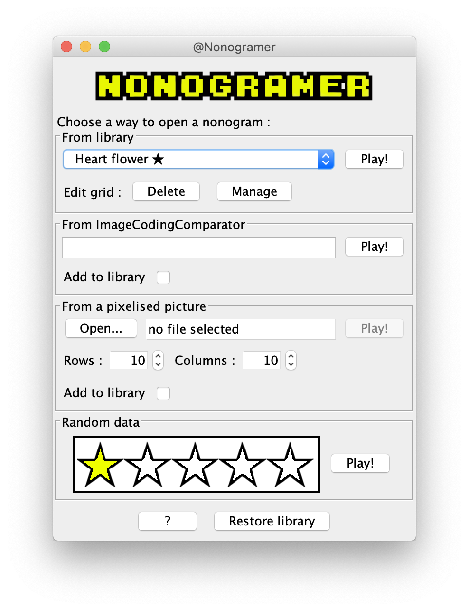
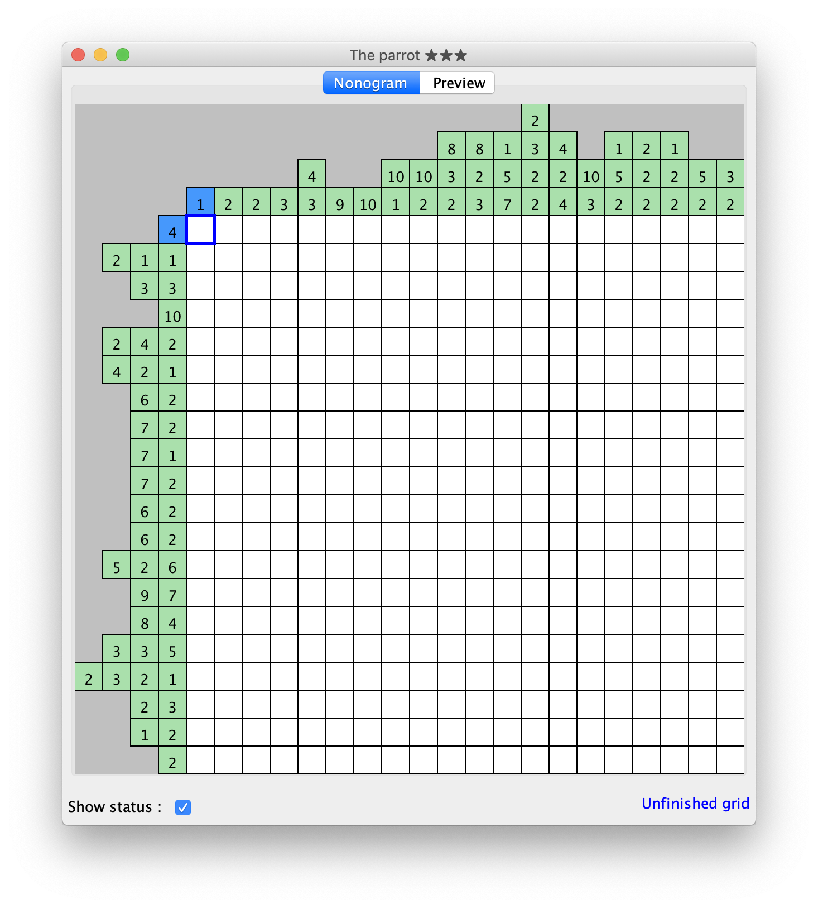
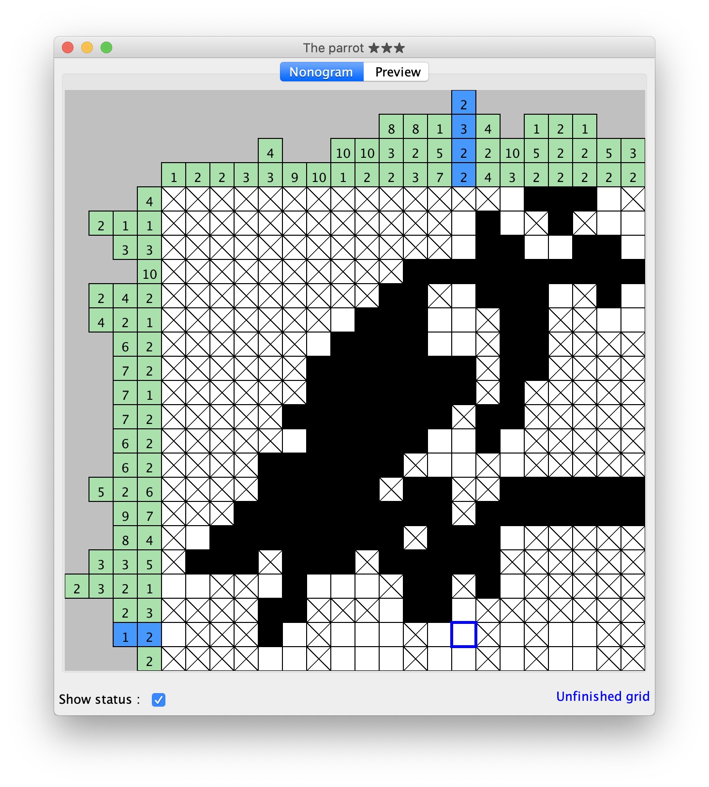
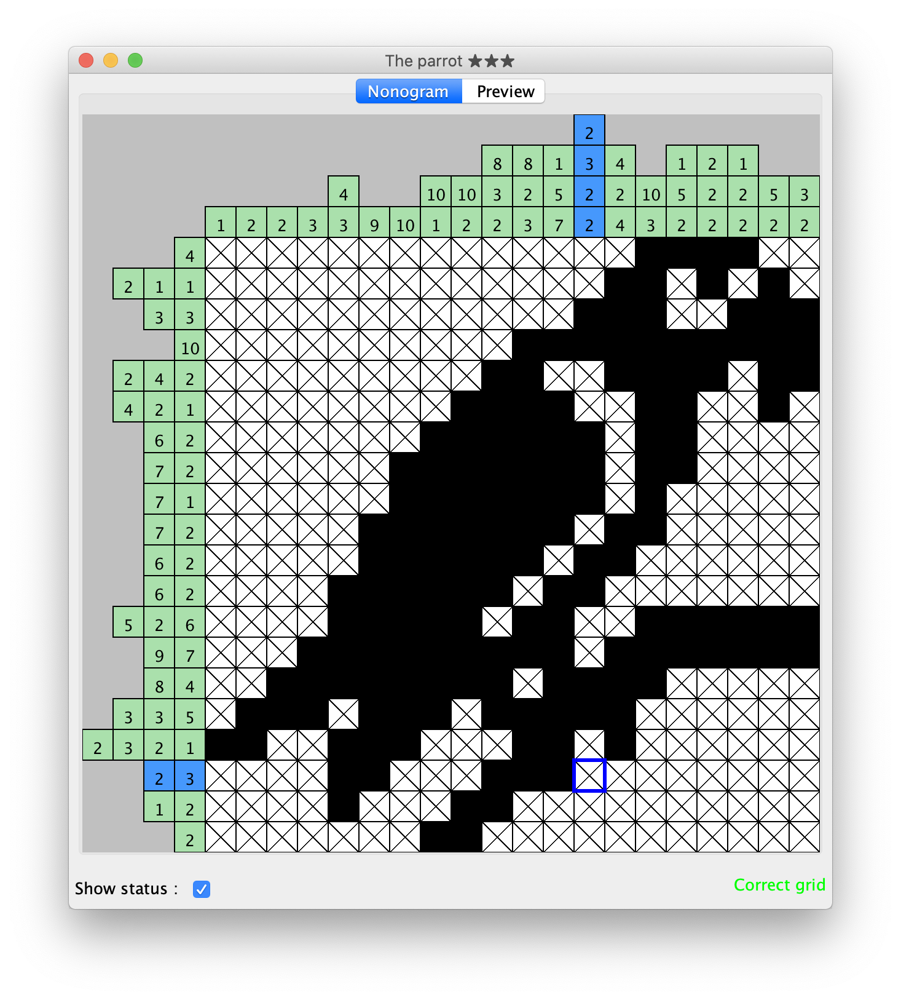

# Nonogramer

Import and play on your favorite [Nonogram](https://en.wikipedia.org/wiki/Nonogram) grids! If you feel like playing straight away, there's a bunch of grids already in the app, and there is also a _random_ mode which is quite challenging.

## How to Run

1. Make sure to have Java installed.
2. Double click on Nonogramer.jar.
3. Alternatively, run ```java -jar <path/to/jar>```on your favorite terminal.

## Code Highlights

See the parser class for some basic computer vision algorithm and stream decoding.

## Sample Screenshots

   
